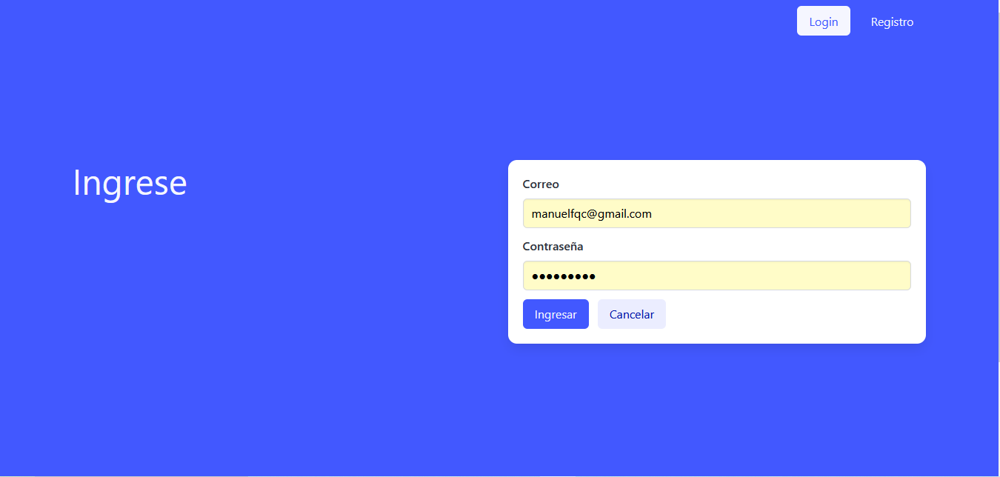
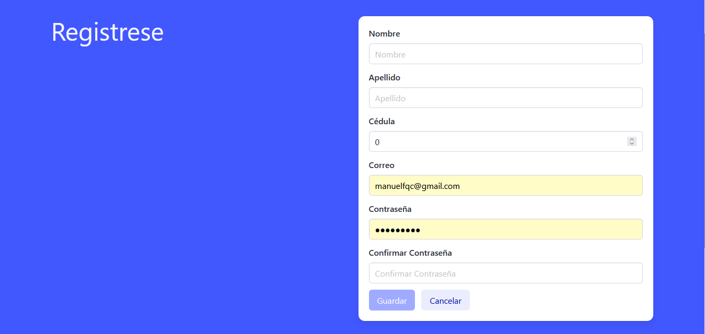
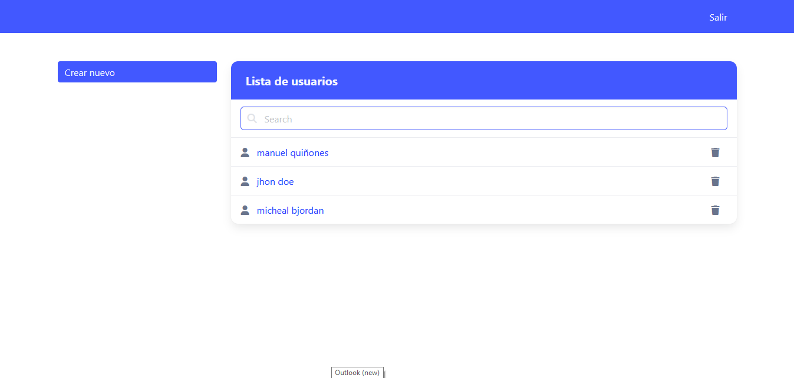
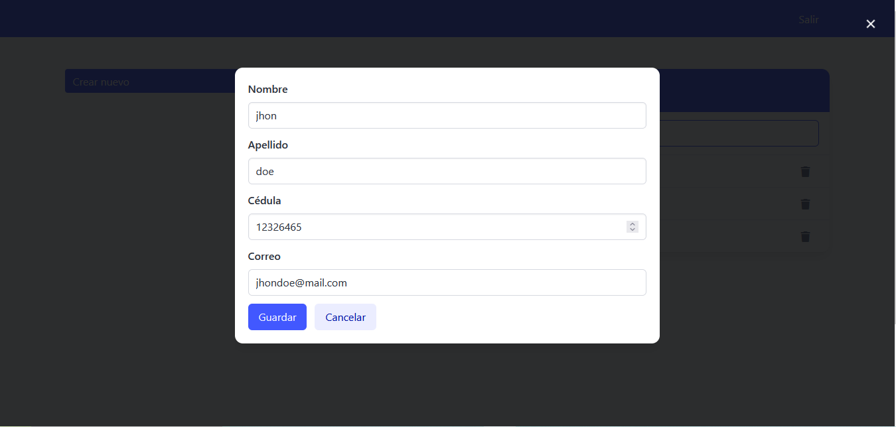

# GodoyCordoba
Prueba Técnica 

## Descripción 

- El Backend está realizado en .NET 6.0 para iniciarlo se tienen que crear inicialmente en SQL Server la base de datos del archivo  `UsuarioDb.sql`.

- Según las credenciales de SQL Server se debe cambiar la cadena de conexión `UsuarioDbConnection` en el archivo `appsettings.json` de la carpeta backend

- Se puede iniciar el backend con el comando `dotnet run`

- El Frontend está realizado en Angular CLI: 16.2.16 para iniciarlo se debe ejecutar el comando `ng serve -o` dentro de la carpeta frontend

